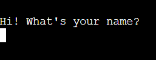

# [The Ultimate Batthleship Game](https://github.com/MichalPokojny/MyProject3-TheBattleshipGame)

The Ultimate Battleship game is a python game which is deployed at Code Institute mock terminal on Heroku. 
This game was originally created as a part of the 3rd project in "Full Stack Software Developer" course at Code Institute.

This short battleship game, is made of getting 3 guesses from the user to try to get the location of the ship.

  

[Live version of my project](https://the-battleship-game.herokuapp.com/)

## How to play

[Battleship](https://en.wikipedia.org/wiki/Battleship_(game)) game is a well known classic pen and paper game, where user has to find the location of the enemy ships.
- This game is set on 5x5 playing field.
- Users have only 3 guesses to try to locate only 1 ship in this version.
- If users ran out of the tries than it is a game over, if he manage to find it in 3 guesses then it's a Win!
- Users enter their name at the beginning, then typing in number from 0 - 4 for row and column.
- This version of the game won't take the same location number input, users has to type in different number every time.

## User stories

- As a visiting user, I want to play a simple quick game of battleships.

## Features

**User Name**

  

 

- At the beggining of this game, users are asked for the name prompt to terminal.
- Then the users name are used to welcome section, and later for the results of the game.

**Welcome and instruction section of the game**

  

 

- At this section, there is a welcome sign with prompted user name.
- This section also include a quick instructions of game rules. 

**Game section**

- At this section after user type in the number for row and column, print of hitting or missing the target.
- If users miss the location, print of text saying that target is missed is shown together with tries that user has left to hit the target.
- Game ask users if they want to continue or finish the game and start again. 

  

- If users hit the target, print of text saying that target has been hit. Short text of saying well done to user name that has been prompted at the beginning.
- The board of the game with the random set location of the ship as '@' is also printed.
- After game is finished, prompt from users to press any key is to continue is needed to play the game again.

  

 

- If users miss the target 3 times, text of game over is printed.
- Game wish better luck next time to user name that has been prompted.
- The board of the game is printed with the set random location of the ship as '@', and user guessed locations as 'X'.
- After game is finished, prompt from users to press any key is to continue is needed to play the game again.

  

 

**Error handling**

- If users type in number that is not between 0 - 4, then message of incorrect input is shown.

  

- If user not type in any number, then message of incorrect input is shown.

  

- If user type in same row and column number, then message of same input location number has been prompt.
- Game asks users to type in different numbers.

  

## Future features

- Add option to switch to game of 2 players, playing against each other.
- Add option to swith to game with more ships, player would have 10 tries to sink them all.

## Flow Chart

## Data Model

- I've used Game board class as my model.
- The class Game board stores board size, number of ships. Size of the board can be changed as well as number of ships.
- The game also has stored methods to add ship, guessing the location and printing the board to user.

## Technologies used

- GitPod - Workspace of the project.
- GitHub - Hosting the repository.
- Heroku - Hosting the mock terminal of the game.
- Grammarly - Grammar check of all the text on the website and readme file.
- Lucid - Flow chart planning of the code.

## Testing

I have mannually tested this project by doing the following:

- Passed the code through pycodecode extension in my workspace. No errors in my code found.
- Given invalid inputs: strings, number out of range, no input at all.
- Tested in my local terminal and at the Code Institute Heroku terminal.

**Bugs**

-- No bugs made during the develop of the project

**Validator testing**

- Pycodecode extension in gidpod workspace.
  - No error were returned from my written code.

**Unfixed bugs**

No unfixed bugs

## Testing user stories

**Game**

- Expected
-- Feature is expected to 

- Testing
-- 

- Result 
-- 

****

- Expected
-- 

- Testing
-- 

- Result 
-- 

## Deployment

- The site was deployed to GitHub pages and Heroku using Code Institute mock terminal. The steps to deploy are as follows:

- GitHub repository:

  - In the GitHub repository, navigate to the Settings tab
  - From the source section drop-down menu, select the Master Branch
  - Once the Master Branch has been selected, the page will be automatically refreshed with a detailed ribbon display to indicate the successful deployment.

  The live link can be found here - https://github.com/MichalPokojny/MyProject3-TheBattleshipGame

  - The site can be also deployed on GitPod. The steps to deploy are as follows:
   - In the gitpod workspace go to MyProject1 click on the index.html
   - Once opened, in the terminal type: python3 -m http.server
   - Local link will appear in the terminal, click on it and the webpage will open in a new tab.

- To Fork this repositary:

  - Navigate to GitHub project repositary [My Project3 The Ultimate Battleship Game](https://github.com/MichalPokojny/MyProject3-TheBattleshipGame)
  - In the right hand corner see the "Fork" section and click on it.
  - Select an owner for the forked repository.
  - Click Create fork button.

- Heroku deployment:

  - Fork or clone this repositary.
  - Create new Heroku app.
  - Set confing var key "PORT" to 8000 value.
  - Set the buildbacks to Python and NodeJS in that order.
  - Link the Heroku app to the repository.
  - Click on Deploy.
  

## Credits

- Inspiration and some of the code of this game were taken from the [Love-sandwiches](https://github.com/AJGreaves/love-sandwiches) and ULTIMATE battheship game project at Code Institute.
- Slack community for support on resolving issues.
- [TechWithTim YouTube channel](https://www.youtube.com/c/TechWithTim) for better understanding object oriented programming to develop my project.

## Acknowledgements

- First I would like to thank my partner Jane for her continuous support and for helping me with grammar checks and correct wording.
- I would like to also thank my mentor [Rohit Sharma](https://github.com/rohit0286) for the support in deploying my third project.