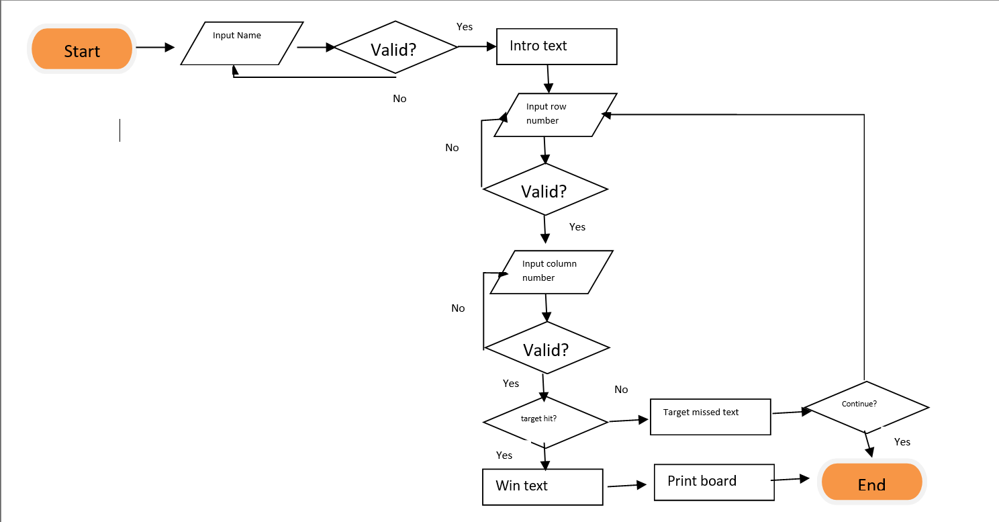

# [The Ultimate Battleship Game](https://github.com/MichalPokojny/MyProject3-TheBattleshipGame)

The Ultimate Battleship game is a python game that is deployed at the Code Institute mock terminal on Heroku. 
This game was created as a part of the 3rd project in the "Full Stack Software Developer" course at the Code Institute.

This short Battleship game gives users three attempts to get to the location of the ship.

  

[Live version of my project](https://the-battleship-game.herokuapp.com/)

## How to play

[Battleship](https://en.wikipedia.org/wiki/Battleship_(game)) is a well-known classic pen and paper game, where the users have to find the location of the enemy ships.

- This game is set on a 5x5 playing field.
- Users have 3 attempts to locate the ship in this version.
- If the user runs out of attempts without locating the ship the game is over, otherwise it's a Win!
- Users enter their name at the beginning, then insert a number from 0 - 4 for both rows and columns.
- This version of the game only allows users to try unique locations using different numbers every time so that they cannot attempt the same location more than once.

## User stories

- As a visiting user, I want to play a simple, quick game of Battleship.

## Features

**User Name**

  

 

- The first action in this game prompts users to input their name into the terminal.
- Then the user's name is used in the welcome section and later on in the results section of the game.

**Introduction section of the game**

  

 

- In this section, there is a welcome message with a prompt for the user to enter their name.
- This section also includes concise instructions relating to the rules of the game. 

**Game section**

- In this section, the user inputs a number between 0-4 for both the row and the column. This displays a feedback message stating whether they hit or missed the target.
- If the user misses the Battleship location, the unsuccessful feedback message displays and includes the number of attempts the user has left to hit the target.
- The game asks the user if they would like to continue or if they would like to finish the game. 

  

- If users hit the target, the successful feedback message displays, confirming they won the game and includes the user name inputted at the beginning.
- The board of the game is presented displaying 'X' for any failed attempts at locating the ship and the randomly located position of the Battleship as '@'.
- After the game is finished, the user is prompted to press enter to close the game.

  

 

- If users miss the target 3 times, the unsuccessful feedback message including the user name inputted at the beginning. 
- The user is also wished better luck for the next round of the game.
- The board of the game is presented displaying 'X' for the 3 failed attempts at locating the ship as well as the randomly located position of the Battleship at '@'.
- After the game is finished, the user is prompted to press enter to close the game.

  

 

**Error handling testing**

- If users enter a number that is not between 0 - 4 a feedback message displays informing them that they inputted incorrect values and instructs them to re-select a location.

  

- If users do not enter any value a feedback message displays informing them that they inputted incorrect values and instructing them to re-select a location.

  

- If the user inputs the same row and column number more than once, a feedback message displays informing them that they previously the selected values and instructs them to re-select a location.

  

## Future features

- Add the option to enable 2 users to play the game against each other.
- Add the option to have more than one Battleship, with 10 attempts to locate the target.

## Flow Chart

Flow chart of the code

  

## Data Model

- The class Game board is the model used for this version of Battleship.
- The class Game board stores the board size and the number of Battleships attributes. The size of the board can be modified as well as the number of ships.
- The class Game board also has methods such as adding ships, populating the game board with random ship locations, guessing the location, and presenting the board to the user.

## Technologies used

- GitPod - Workspace of the project.
- GitHub - Stores the repository.
- Heroku - Hosting the mock terminal of the game.
- Grammarly - Grammar check of all the text on the website and readme file.
- Lucid - Flow chart planning of the code.

## Testing

Testing was performed by the developer and a random tester using the below method: 

- Passing the code through Pycodecode extension in the
GitPod workspace without finding any errors. 
- Inputting invalid values in the game such as strings, numbers out of the 0-4 range as well as entering a null value which correctly presented the unsuccessful message and option to re-try.
- Testing carried out in two locations including the GitPod local terminal and at the Code Institute Heroku mock terminal.

**Bugs**

- No bugs were found during the development of the project.

**Validator testing**

- Pycodecode extension in GitPod workspace.
  - No errors were found.

**Unfixed bugs**

No unfixed bugs

## Testing user stories

**User Name Input**

- Expected
Feature is expecting the user's name prompt and then presents a welcome message with the previously entered user name.

  

- Testing
Tested the feature to input the user's name into the terminal.

  

- Result 
Feature responded as expected. 

  

**Input numbers to guess the location**

- Expected
Feature is expecting the user to insert a number between 0-4 for both the row and column to try to find the location of the Battleship, and then presents a successful or unsuccessful feedback message.

  

- Testing
Tested the feature to input numbers for rows and columns.

  

- Result 
Feature responded as expected.

  

## Deployment

- The site was deployed to GitHub pages and Heroku using the Code Institute mock terminal. The steps involved in deployment are as follows:

- GitHub repository:

  - In the GitHub repository, navigate to the "Settings" tab.
  - From the source section drop-down menu, select the "Master Branch".
  - Once the Master Branch has been selected, the page will automatically refresh displaying a detailed ribbon to indicate the successful deployment.

  The live link can be found here - https://github.com/MichalPokojny/MyProject3-TheBattleshipGame

  - The game can be also deployed on GitPod. The steps to deploy are as follows:
   - In the GitPod workspace, navigate to "MyProject3 The Battleship Game" and click on "run.py".
   - Once opened in the terminal, type "python3 -m run.py".
   - The game will start in the terminal.

- To Fork this repository:

  - Navigate to GitHub project repository [My Project3 The Ultimate Battleship Game](https://github.com/MichalPokojny/MyProject3-TheBattleshipGame)
  - Click on the "Fork" section in the right-hand corner.
  - Select an owner for the forked repository.
  - Click "Create fork" button.

- Heroku deployment:

  - Fork or clone this repository.
  - Create a new Heroku app.
  - Set config var key "PORT" to 8000 value.
  - Set the build backs to Python and NodeJS in that order.
  - Link the Heroku app to the repository.
  - Click "Deploy".

  

## Credits

- Inspiration and some of the code of this game were taken from the [Love-sandwiches](https://github.com/AJGreaves/love-sandwiches) and ULTIMATE battleship game project at Code Institute.
- The slack community for support on resolving issues.
- [TechWithTim YouTube channel](https://www.youtube.com/c/TechWithTim) for increasing the developer's understanding of object-oriented programming to develop the project

## Acknowledgements

- I would like to thank my mentor [Rohit Sharma](https://github.com/rohit0286) for their continued support in deploying my third project.