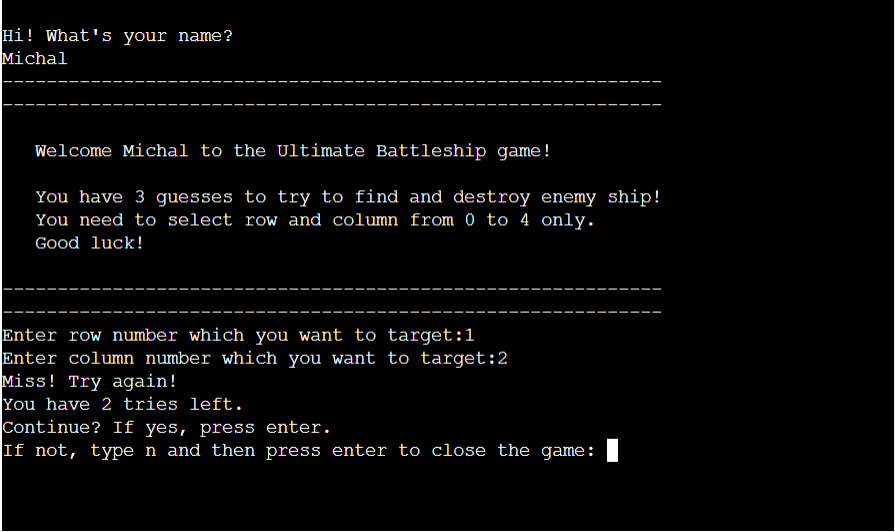

# [The Ultimate Batthleship Game](https://github.com/MichalPokojny/MyProject3-TheBattleshipGame)

The Ultimate Battleship game is a python game that is deployed at Code Institute mock terminal on Heroku. 
This game was created as a part of the 3rd project in the "Full Stack Software Developer" course at Code Institute.

This short battleship game is made of getting 3 guesses from the user to try to get the location of the ship.

  

[Live version of my project](https://the-battleship-game.herokuapp.com/)

## How to play

[Battleship](https://en.wikipedia.org/wiki/Battleship_(game)) 
 game is a well-known classic pen and paper game, where the users has to find the location of the enemy ships.
- This game is set on a 5x5 playing field.
- Users have only 3 guesses to try to locate only 1 ship in this version.
- If the users ran out of tries then it is a game over, if he manages to find it in 3 guesses then it's a Win!
- Users enter their name at the beginning, then type in a number from 0 - 4 for rows and columns.
- This version of the game won't take the same location number input, users has to type in different number every time.

## User stories

- As a visiting user, I want to play a simple quick game of battleships.

## Features

**User Name**

  

 

- At the beginning of this game, users are asked for the name prompt to the terminal.
- Then the user's name is used for to welcome section, and later for the results of the game.

**Welcome and instruction section of the game**

  

 

- In this section, there is a welcome sign with a prompted user name.
- This section also includes quick instructions on game rules. 

**Game section**

- In this section after the user type in the number for row and column, print of hitting or missing the target.
- If users miss the location, a print of text saying that the target is missed is shown together with tries that the user has left to hit the target.
- The game ask users if they want to continue or finish the game and start again. 

  

- If users hit the target, print text saying that the target has been hit. Short text saying well done to the user name that has been prompted at the beginning.
- The board of the game with the random set location of the ship as '@' is also printed.
- After the game is finished, a prompt from users to press any key to continue is needed to play the game again.

  

 

- If users miss the target 3 times, the text of the game over is printed.
- Game wishes better luck next time to the user name that has been prompted.
- The board of the game is printed with the set random location of the ship as '@', and user-guessed locations as 'X'.
- After the game is finished, a prompt from users to press any key to continue is needed to play the game again.

  

 

**Error handling testing**

- If users type in a number that is not between 0 - 4, then a message of incorrect input is shown.

  

- If the user does not type in any number, then a message of incorrect input is shown.

  

- If the user type in the same row and column number, then a message of the same input location number has been prompted.
- The game asks users to type in different numbers.

  

## Future features

- Add the option to switch to a game of 2 players, playing against each other.
- Add the option to switch to a game with more ships, the player would have 10 tries to sink them all.

## Flow Chart

## Data Model

- I've used the Game board class as my model.
- The class Game board stores board size, and the number of ships. The size of the board can be changed as well as the number of ships.
- The game class also has methods stored for adding ships, populating the game board with random ship locations, guessing the location, and printing the board to the user.

## Technologies used

- GitPod - Workspace of the project.
- GitHub - Hosting the repository.
- Heroku - Hosting the mock terminal of the game.
- Grammarly - Grammar check of all the text on the website and readme file.
- Lucid - Flow chart planning of the code.

## Testing

I have manually tested this project by doing the following:

- Passed the code through pycodecode extension in my workspace. No errors in my code were found.
- Given invalid inputs: strings, number out of range, no input at all.
- Tested in my local terminal and at the Code Institute Heroku terminal.

**Bugs**

-- No bugs made during the develop of the project

**Validator testing**

- Pycodecode extension in gitpod workspace.
  - No errors were returned from my written code.

**Unfixed bugs**

No unfixed bugs

## Testing user stories

**User Name Input**

- Expected
-- Feature is expected to get a user name prompt and then print a welcome message with the prompted user name.

  

- Testing
-- Tested the feature to input my name into the terminal.

  

- Result 
-- Feature responded as expected. Printing the welcome message with my name.

  

**Input numbers to guess the location**

- Expected
-- Feature is expected to get the number for row and column from users to try to get the location of the ship.

  

- Testing
-- Tested the feature to input numbers for rows and columns.

  

- Result 
-- Feature responded as expected. Printing message Hit or Miss.

  

## Deployment

- The site was deployed to GitHub pages and Heroku using Code Institute mock terminal. The steps to deploy are as follows:

- GitHub repository:

  - In the GitHub repository, navigate to the Settings tab
  - From the source section drop-down menu, select the Master Branch
  - Once the Master Branch has been selected, the page will be automatically refreshed with a detailed ribbon display to indicate the successful deployment.

  The live link can be found here - https://github.com/MichalPokojny/MyProject3-TheBattleshipGame

  - The game can be also deployed on GitPod. The steps to deploy are as follows:
   - In the gitpod workspace go to MyProject3 The Battleship Game and click on the run.py
   - Once opened, in the terminal type: python3 -m run.py
   - Game will start in terminal

- To Fork this repository:

  - Navigate to GitHub project repository [My Project3 The Ultimate Battleship Game](https://github.com/MichalPokojny/MyProject3-TheBattleshipGame)
  - In the right-hand corner see the "Fork" section and click on it.
  - Select an owner for the forked repository.
  - Click Create fork button.

- Heroku deployment:

  - Fork or clone this repository.
  - Create a new Heroku app.
  - Set config var key "PORT" to 8000 value.
  - Set the build backs to Python and NodeJS in that order.
  - Link the Heroku app to the repository.
  - Click on Deploy.

  

## Credits

- Inspiration and some of the code of this game were taken from the [Love-sandwiches](https://github.com/AJGreaves/love-sandwiches) and ULTIMATE battleship game project at Code Institute.
- Slack community for support on resolving issues.
- [TechWithTim YouTube channel](https://www.youtube.com/c/TechWithTim) for better understanding object-oriented programming to develop my project.

## Acknowledgements

- First I would like to thank my partner Jane for her continuous support and for helping me with grammar checks and correct wording.
- I would like to also thank my mentor [Rohit Sharma](https://github.com/rohit0286) for the support in deploying my third project.